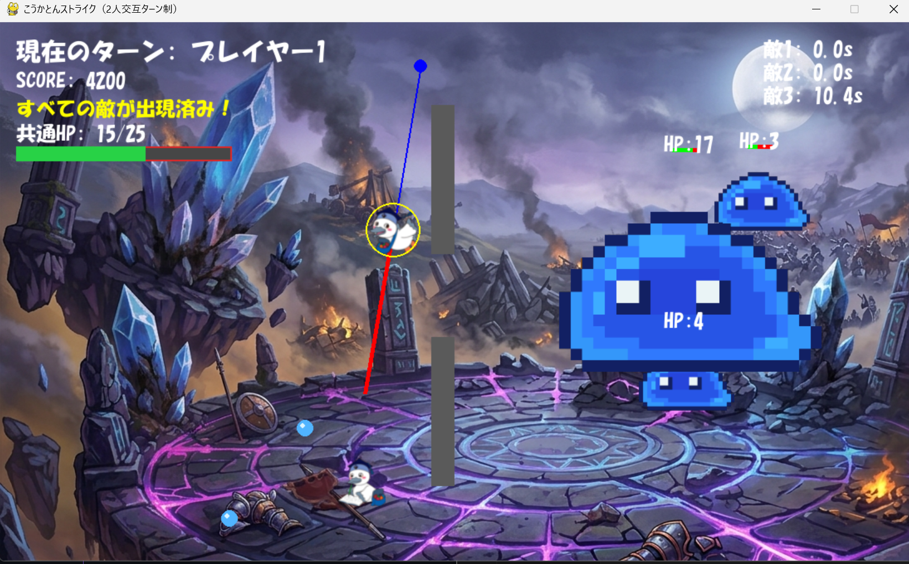

# ひっぱるこうかとんストライク

## 実行環境の必要条件
* python >= 3.10
* pygame >= 2.1

## ゲームの概要
* 主人公キャラクター「こうかとん」をマウス操作で引っ張って弾き、敵や障害物にぶつけて敵を倒す、2人こうゴターン性アクションゲームです。
* ゲームの基本構造は「モンスターストライク」を参考にしており、引っ張り操作・跳ね返り・コンボ・敵の反撃など多彩な要素を組み合わせた戦略的なプレイが楽しめます
* 参考URL：[モンスターストライク](https://www.monster-strike.com/)

## ゲームの遊び方
* **こうかとんをマウスカーソルでドラッグして引っ張り、離して発射する。**
  * 引っ張る距離と方向で、こうかとんの速度と進行方向が決まる。
* **こうかとんを味方に当てて「愛情コンボ」を発動させる。**
  * 味方にぶつかると、全ての敵に追加ダメージ＋エフェクトが発生し、効率よく敵を削れる。
* **敵に直接当ててもよいが、ステージ上には壁や障害物があるため、愛情コンボを活用すると有利。**
* プレイヤーは2人（2匹のこうかとん）で、**交互にターンを回しながら敵を倒していく。**
* 敵の攻撃や水の球に当たるとHPが減り、**共通HPが0になるとゲームオーバー**。

## ゲームの実装
* 背景画像：戦場（`fig/senjou.png`）を画面全体に描画。
* 主人公キャラクター「こうかとん」：  
    * 画像ファイル（`fig/3.png`, `fig/1.png`）を読み込み、2匹のこうかとんを表示。
* 敵キャラクター：  
  * スライム画像（`fig/suraimu.png`）を読み込み、通常敵とボス敵を描画。
* 衝突時のヒットエフェクト：  
  * `fig/hit.png` を縮小して、敵に当たった瞬間に短時間表示する画像エフェクトを実装。

* サウンド： ゲームプレイ中のBGM（bgm.mp3）の無限ループ再生。
 
### 共通基本機能
* 背景画像と敵、主人公キャラクターの描画

### 分担追加機能

* 衝突時の多段ヒット防止　エフェクト
* ギミックの追加（障害物、敵の追加）
    
* 愛情コンビネーション
* ゲームクリア・オーバー画面の追加

* **衝突時の多段ヒット防止　エフェクト　C0A25220**
    * 敵クラスに 無敵時間（hit_interval, muteki_time）を導入し、  1回の衝突でHPが一気に減りすぎないように制御。
    * 衝突時に **Spark（火花）エフェクト** や **HitEffect（画像エフェクト）** を表示し、  
  視覚的なフィードバックを強化。

* **ギミックの追加（障害物、敵の追加）  C0A25224**
    * 敵を1体ずつ順番に出現させる機能を実装した。敵にはそれぞれ制限時間を設定し、制限時間内に倒せなかった場合は、その敵を画面に残したまま次の敵を追加で出現させるようにした。また、通常敵を一定数出現させた後に、HPが高くサイズの大きいボスキャラクターを出現させる処理を追加した。さらに、敵がプレイヤーの攻撃終了後に水の球を発射し、こうかとんに当たるとHPが減る攻撃ギミックを実装した。加えて、こうかとんがぶつかると跳ね返る壁や、一定回数ぶつかると壊れる壁を配置し、ステージ上の障害物として機能するようにした。  

*  **愛情コンビネーション              C0A25248**
    * 味方こうかとん同士の当たり判定を追加。
    * 自分のこうかとんが味方にぶつかると、**愛情コンボ** が発動
    * 画面上の全ての敵に追加ダメージ。
    * 愛情ビーム（線）やエフェクトを表示し、爽快感のある演出を実現。

* **ゲーム終了判定                    C0C25022** 
    * 2匹のこうかとんは PlayerHealth クラスによる共通HP を使用。
    * 水の球によるダメージは、2匹共通のHPと無敵時間で管理。
    * 共通HPが **0以下** になった場合、**ゲームオーバー**。
    * ボス敵のHPが0になった場合、**ゲームクリア**。
    * 結果に応じて **ゲームクリア画面 / ゲームオーバー画面** を表示し、
    * `Rキー`：もう一度遊ぶ（ゲーム再スタート）
    * `Qキー` または `ESCキー`：ゲーム終了 を案内する  

### メモ
* クラス内の変数は，すべて，「get_変数名」という名前のメソッドを介してアクセスするように設計してある
* すべてのクラスに関係する関数は，クラスの外で定義してある